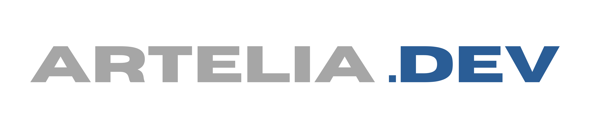

# 🚀 LaravelProjectContainer

<div align="center">


[](https://docker.com)
[](https://laravel.com)
[](https://frankenphp.dev)
[](https://mysql.com)
[](https://redis.io)

[](https://semver.org)
[](LICENSE)
[](https://github.com/denis156)
[](https://artelia.dev)

</div>

> **🎉 The Ultimate Laravel Development Container by Artelia.Dev** - Karena hidup terlalu singkat untuk setup environment berulang-ulang! 

<div align="center">



**Created with ❤️ by [Denis Djodian Ardika](https://github.com/denis156) - Leader & Founder of Artelia.Dev**

</div>

## 🌟 What's This Magic?

LaravelProjectContainer adalah solusi **All-in-One** untuk developer Laravel yang ingin:
- ✨ Setup development environment dalam **1 command**
- 🎯 Manage multiple Laravel projects dalam **1 container**
- 🚀 Deploy ke production dengan **terminal commands**
- 🎪 Fokus coding, bukan setup environment!

```bash
# Setup magic dalam 3 langkah! 🪄
git clone https://github.com/denis156/LaravelProjectContainer.git
cd LaravelProjectContainer
docker-compose up -d

# Create project baru (auto-configured!) ⚡
./Terminal/project.sh new awesome-app

# Start development 🔥
./Terminal/dev.sh start
./Terminal/dev.sh open  # Browser auto-open! 🌐
```

## 🎯 Features yang Bikin Happy

### 🏗️ **Development Made Easy**
- **Multi-Project Management** - 1 container, unlimited projects!
- **Hot Reload** - File berubah? Cache auto-clear! 
- **Terminal-Based** - Semua operasi lewat terminal yang user-friendly
- **Auto Port Assignment** - No more port conflicts!

### ⚡ **Modern Tech Stack**
- **FrankenPHP** - HTTP/2, HTTP/3, WebSockets support
- **MySQL + Redis** - Database dan caching yang reliable
- **Supervisor** - Background processes yang never sleep
- **phpMyAdmin** - Database management yang visual

### 🚀 **Production Ready**
- **One-Command Deployment** - Deploy tanpa drama!
- **SSL Auto-Generated** - Let's Encrypt integration
- **Zero-Downtime Deploy** - Users happy, boss happy!
- **Rollback Support** - Oops? No problem! 

### 🎪 **Developer Experience**
- **Colored Terminal Output** - Pretty logs untuk mata yang senang
- **Interactive Commands** - Smart confirmations & validations
- **Auto-Completion** - Terminal shortcuts yang bikin cepat
- **Comprehensive Logging** - Debug dengan mudah

## 📦 What's Inside?

```
LaravelProjectContainer/
├── 🏗️ Projects/              # Laravel projects home
├── 🖥️ Terminal/              # Magic terminal scripts
├── ⚙️ Supervisor/            # Background process configs
├── 🎨 Image/                 # Container images & assets
├── 🐳 docker-compose.yml     # Container orchestration
├── 🔧 Dockerfile            # Custom FrankenPHP image
├── 🌐 frankenphp.Caddyfile  # Web server config
└── 📚 docs/                 # Documentation
```

## 🚀 Quick Start Guide

### 1. **Prerequisites** 
```bash
# Yang perlu di-install:
- Docker & Docker Compose 🐳
- Git (untuk cloning projects) 📦
- Terminal yang support colors 🎨
```

### 2. **Installation**
```bash
# Clone the magic! ✨
git clone https://github.com/denis156/LaravelProjectContainer.git
cd LaravelProjectContainer

# Setup terminal scripts permissions 🔧
chmod +x setup_terminal.sh
./setup_terminal.sh

# Copy environment file
cp .env.example .env

# Start the container! 🚀
docker-compose up -d

# Wait for magic to happen... ⏳
# Check status
docker-compose ps
```

### 3. **Create Your First Project**
```bash
# Enter the container
docker exec -it laravel_frankenphp bash

# Create new Laravel project (auto-configured!) 🎯
./Terminal/project.sh new my-awesome-app

# Start development environment 🔥
./Terminal/dev.sh start

# Open in browser (auto!) 🌐
./Terminal/dev.sh open
```

### 4. **Development Workflow**
```bash
# Switch between projects 🔄
./Terminal/project.sh switch another-app

# Run artisan commands 🎪
./Terminal/artisan.sh migrate
./Terminal/artisan.sh make model User -mcr

# Manage composer packages 📦
./Terminal/composer.sh require laravel/telescope --dev

# Database operations 🗄️
./Terminal/database.sh backup my-app
./Terminal/database.sh fresh my-app

# Deploy to production 🚀
./Terminal/deploy.sh deploy my-app production
```

### 5. **Optional: Setup Global Commands**

Want shorter commands? Setup global aliases:

#### 🔧 **Manual Path Setup (Temporary):**
```bash
# Add to PATH untuk session ini
export PATH="$(pwd)/bin:$PATH"

# Test
project help
```

#### 🚀 **Permanent Setup (Recommended):**
```bash
# For Zsh users (macOS default)
echo 'export PATH="$(pwd)/bin:$PATH"' >> ~/.zshrc
source ~/.zshrc

# For Bash users  
echo 'export PATH="$(pwd)/bin:$PATH"' >> ~/.bashrc
source ~/.bashrc

# Test
project help
```

#### 🎯 **Alternative: Use Direct Path**
Prefer manual commands? No setup needed:

```bash
./Terminal/project.sh help
./Terminal/dev.sh start
./Terminal/artisan.sh migrate
```

> **💡 Note:** Manual commands (./Terminal/script.sh) always work without any setup!

## 📚 Documentation

Dokumentasi lengkap tersedia untuk setiap komponen:

### 🖥️ [Terminal Scripts Documentation](Terminal/doc_terminal.md)
Panduan lengkap semua terminal commands yang tersedia:
- **Project Management** - Create, switch, manage projects
- **Development Workflow** - Start, stop, monitor development
- **Artisan Shortcuts** - Laravel commands made easy
- **Composer Management** - Package management
- **Database Operations** - Backup, restore, migrate
- **Domain Management** - Custom domains & SSL
- **Deployment Automation** - Production deployment

### 📁 [Projects Documentation](Projects/doc_projects.md)
Cara kerja project management system:
- **Multi-Project Setup** - Manage multiple Laravel apps
- **Port Assignment** - Auto port allocation
- **Environment Configuration** - Per-project settings
- **Hot Reload** - Development optimization

### ⚙️ [Supervisor Documentation](Supervisor/doc_supervisor.md)
Background processes dan monitoring:
- **Queue Workers** - Laravel job processing
- **Task Scheduler** - Cron job management
- **Process Monitoring** - Health checks & auto-restart
- **Log Management** - Centralized logging

## 🎪 Available Commands

> **💡 Command Usage Options:**  
> - **Manual**: `./terminal/script.sh command` (always works)  
> - **Alias**: `script command` (after PATH setup - see installation notes)

### Project Management 🏗️
```bash
# Manual usage:
./terminal/project.sh new <name>           # Create new project
./terminal/project.sh list                 # List all projects  
./terminal/project.sh switch <name>        # Switch active project
./terminal/project.sh delete <name>        # Delete project
./terminal/project.sh clone <git-url>      # Clone from Git

# Alias usage (after PATH setup):
project new <name>                         # Create new project
project list                               # List all projects  
project switch <name>                      # Switch active project
project delete <name>                      # Delete project
project clone <git-url>                    # Clone from Git
```

### Development Workflow ⚡
```bash
# Manual usage:
./Terminal/dev.sh start                    # Start development
./Terminal/dev.sh stop                     # Stop development
./Terminal/dev.sh restart                  # Restart services
./Terminal/dev.sh open                     # Open in browser
./Terminal/dev.sh logs [type]              # View logs

# Alias usage (after PATH setup):
dev start                                  # Start development
dev stop                                   # Stop development
dev restart                                # Restart services
dev open                                   # Open in browser
dev logs [type]                            # View logs
```

### Laravel Artisan 🎯
```bash
# Manual usage:
./Terminal/artisan.sh migrate              # Run migrations
./Terminal/artisan.sh make model User      # Create model
./Terminal/artisan.sh serve                # Development server
./Terminal/artisan.sh queue work           # Start queue worker
./Terminal/artisan.sh tinker               # Laravel REPL

# Alias usage (after PATH setup):
artisan migrate                            # Run migrations
artisan make model User                    # Create model
artisan serve                              # Development server
artisan queue work                         # Start queue worker
artisan tinker                             # Laravel REPL
```

### Database Management 🗄️
```bash
# Manual usage:
./Terminal/database.sh backup <project>    # Backup database
./Terminal/database.sh restore <project> <file>  # Restore backup
./Terminal/database.sh fresh <project>     # Fresh migration
./Terminal/database.sh clone <src> <dest>  # Clone database

# Alias usage (after PATH setup):
database backup <project>                  # Backup database
database restore <project> <file>          # Restore backup
database fresh <project>                   # Fresh migration
database clone <src> <dest>                # Clone database
```

### Domain & SSL 🌐
```bash
# Manual usage:
./Terminal/domain.sh add myapp.com         # Add production domain
./Terminal/domain.sh add myapp.test dev    # Add dev domain  
./Terminal/domain.sh ssl enable myapp.com  # Enable SSL
./Terminal/domain.sh list                  # List all domains

# Alias usage (after PATH setup):
domain add myapp.com                       # Add production domain
domain add myapp.test dev                  # Add dev domain  
domain ssl enable myapp.com                # Enable SSL
domain list                                # List all domains
```

### Deployment 🚀
```bash
# Manual usage:
./Terminal/deploy.sh deploy myapp staging     # Deploy to staging
./Terminal/deploy.sh deploy myapp production  # Deploy to production
./Terminal/deploy.sh rollback myapp production # Rollback deployment
./Terminal/deploy.sh status myapp             # Check deployment status

# Alias usage (after PATH setup):
deploy myapp staging                       # Deploy to staging
deploy myapp production                    # Deploy to production
deploy rollback myapp production           # Rollback deployment
deploy status myapp                        # Check deployment status
```

### Composer Management 📦
```bash
# Manual usage:
./Terminal/composer.sh install             # Install dependencies
./Terminal/composer.sh require <package>   # Add new package
./Terminal/composer.sh update              # Update packages
./Terminal/composer.sh remove <package>    # Remove package

# Alias usage (after PATH setup):
composer-laravel install                   # Install dependencies
composer-laravel require <package>         # Add new package
composer-laravel update                    # Update packages
composer-laravel remove <package>          # Remove package
```

## 🔧 Global Commands Setup (Optional)

Untuk menggunakan commands dengan alias (contoh: `project help` instead of `./terminal/project.sh help`):

### Option 1: Temporary (Current Session Only)
```bash
# After running ./setup_terminal.sh, add to PATH:
export PATH="$(pwd)/bin:$PATH"

# Test alias commands:
project help
dev start
artisan migrate
```

### Option 2: Permanent Setup
```bash
# For Zsh users (macOS default):
echo 'export PATH="/path/to/LaravelProjectContainer/bin:$PATH"' >> ~/.zshrc
source ~/.zshrc

# For Bash users:
echo 'export PATH="/path/to/LaravelProjectContainer/bin:$PATH"' >> ~/.bashrc
source ~/.bashrc

# Replace /path/to/LaravelProjectContainer with your actual path
```

### Option 3: Manual Usage (No Setup Required)
```bash
# Just use the manual commands - they always work!
./terminal/project.sh help
./terminal/dev.sh start
./terminal/artisan.sh migrate
```

> **💡 Recommendation:** Start with manual commands first, then setup aliases if you prefer shorter commands!

## 🌈 Environment Configuration

Customize container behavior via `.env` file:

```bash
# Database settings
DB_ROOT_PASSWORD=your_secure_password
DB_USERNAME=laravel
DB_PASSWORD=laravel

# Development ports
PROJECT_8000=main-app
PROJECT_8001=api-app
PROJECT_8002=admin-app

# Enable/disable services
ENABLE_PHPMYADMIN=true
ENABLE_MAILHOG=true
ENABLE_MINIO=false

# Performance tuning
PHP_MEMORY_LIMIT=512M
QUEUE_WORKER_PROCESSES=3
```

## 🎯 Production Deployment

Deploy dengan confidence! 🚀

```bash
# Setup production domain
./Terminal/domain.sh add myapp.com myapp production

# Deploy to production (with safety checks!)
./Terminal/deploy.sh deploy myapp production

# Monitor deployment
./Terminal/deploy.sh status myapp production
./Terminal/deploy.sh logs myapp production

# Rollback if needed (safety first!)
./Terminal/deploy.sh rollback myapp production
```

### Production Features:
- ✅ **SSL Auto-Generated** (Let's Encrypt)
- ✅ **Zero-Downtime Deployment**
- ✅ **Automatic Backups** before deployment
- ✅ **Health Checks** post-deployment
- ✅ **Rollback Support** if something goes wrong
- ✅ **Performance Optimization** (caching, compression)

## 🎪 Tips & Tricks

### 🔥 **Development Tips**
```bash
# Quick project switch and open
./Terminal/project.sh switch myapp && ./Terminal/dev.sh open

# Watch logs in real-time
./Terminal/dev.sh logs all  # All logs combined!

# Fresh start when things get messy
./Terminal/dev.sh fresh  # Reset everything!

# Quick artisan commands
./Terminal/artisan.sh mig fresh  # Fresh migration
./Terminal/artisan.sh make:model Post -a  # Model with everything! combined!

# Fresh start when things get messy
./terminal/dev.sh fresh  # Reset everything!

# Quick artisan commands
./terminal/artisan.sh mig fresh  # Fresh migration
./terminal/artisan.sh make:model Post -a  # Model with everything!
```

### 🚀 **Production Tips**
```bash
# Pre-deployment checks
./Terminal/deploy.sh config show myapp

# Monitor after deployment
watch './Terminal/deploy.sh status myapp production'

# Quick rollback if needed
./Terminal/deploy.sh rollback myapp production
```

### 🎯 **Debugging Tips**
```bash
# Check container health
docker-compose ps
docker-compose logs frankenphp

# Check project status
./Terminal/project.sh status myapp

# Database connectivity
./Terminal/database.sh list
```

## 🤝 Contributing

Contributions welcome! Mari buat development experience yang lebih amazing! 

1. Fork the repository 🍴
2. Create feature branch (`git checkout -b amazing-feature`)
3. Commit changes (`git commit -m 'Add amazing feature'`)
4. Push to branch (`git push origin amazing-feature`)
5. Open Pull Request 🎉

## 📄 License

This project is licensed under the MIT License - see the [LICENSE](LICENSE) file for details.

## 🙏 Acknowledgments

- **Laravel Team** - For the amazing framework! 🎉
- **FrankenPHP Team** - For the blazing fast PHP server! ⚡
- **Docker Community** - For containerization magic! 🐳
- **Open Source Community** - For making development fun! ❤️

## 🎮 Have Fun!

> "Life is too short for boring development setups!" - Denis Djodian Ardika

Enjoy coding dengan LaravelProjectContainer! 🚀✨

---

<div align="center">

**Made with ❤️ and lots of ☕ by [Denis Djodian Ardika](https://github.com/denis156)**

**Leader & Founder of [Artelia.Dev](https://artelia.dev)**

[](https://github.com/denis156)
[](https://artelia.dev)

[](https://github.com/denis156/LaravelProjectContainer)
[](https://github.com/denis156/LaravelProjectContainer)

</div> 

## 🌟 What's This Magic?

LaravelProjectContainer adalah solusi **All-in-One** untuk developer Laravel yang ingin:
- ✨ Setup development environment dalam **1 command**
- 🎯 Manage multiple Laravel projects dalam **1 container**
- 🚀 Deploy ke production dengan **terminal commands**
- 🎪 Fokus coding, bukan setup environment!

```bash
# Setup magic dalam 3 langkah! 🪄
git clone <repo-url> LaravelProjectContainer
cd LaravelProjectContainer
docker-compose up -d

# Create project baru (auto-configured!) ⚡
./terminal/project.sh new awesome-app

# Start development 🔥
./terminal/dev.sh start
./terminal/dev.sh open  # Browser auto-open! 🌐
```

## 🎯 Features yang Bikin Happy

### 🏗️ **Development Made Easy**
- **Multi-Project Management** - 1 container, unlimited projects!
- **Hot Reload** - File berubah? Cache auto-clear! 
- **Terminal-Based** - Semua operasi lewat terminal yang user-friendly
- **Auto Port Assignment** - No more port conflicts!

### ⚡ **Modern Tech Stack**
- **FrankenPHP** - HTTP/2, HTTP/3, WebSockets support
- **MySQL + Redis** - Database dan caching yang reliable
- **Supervisor** - Background processes yang never sleep
- **phpMyAdmin** - Database management yang visual

### 🚀 **Production Ready**
- **One-Command Deployment** - Deploy tanpa drama!
- **SSL Auto-Generated** - Let's Encrypt integration
- **Zero-Downtime Deploy** - Users happy, boss happy!
- **Rollback Support** - Oops? No problem! 

### 🎪 **Developer Experience**
- **Colored Terminal Output** - Pretty logs untuk mata yang senang
- **Interactive Commands** - Smart confirmations & validations
- **Auto-Completion** - Terminal shortcuts yang bikin cepat
- **Comprehensive Logging** - Debug dengan mudah

## 📦 What's Inside?

```
LaravelProjectContainer/
├── 🏗️ Projects/              # Laravel projects home
├── 🖥️ Terminal/              # Magic terminal scripts
├── ⚙️ Supervisor/            # Background process configs
├── 🐳 docker-compose.yml     # Container orchestration
├── 🔧 Dockerfile            # Custom FrankenPHP image
├── 🌐 frankenphp.Caddyfile  # Web server config
└── 📚 docs/                 # Documentation
```

## 🚀 Quick Start Guide

### 1. **Prerequisites** 
```bash
# Yang perlu di-install:
- Docker & Docker Compose 🐳
- Git (untuk cloning projects) 📦
- Terminal yang support colors 🎨
```

### 2. **Installation**
```bash
# Clone the magic! ✨
git clone <repository-url> LaravelProjectContainer
cd LaravelProjectContainer

# Copy environment file
cp .env.example .env

# Start the container! 🚀
docker-compose up -d

# Wait for magic to happen... ⏳
# Check status
docker-compose ps
```

### 3. **Create Your First Project**
```bash
# Enter the container
docker exec -it laravel_frankenphp bash

# Create new Laravel project (auto-configured!) 🎯
./terminal/project.sh new my-awesome-app

# Start development environment 🔥
./terminal/dev.sh start

# Open in browser (auto!) 🌐
./terminal/dev.sh open
```

### 4. **Development Workflow**
```bash
# Switch between projects 🔄
./terminal/project.sh switch another-app

# Run artisan commands 🎪
./terminal/artisan.sh migrate
./terminal/artisan.sh make model User -mcr

# Manage composer packages 📦
./terminal/composer.sh require laravel/telescope --dev

# Database operations 🗄️
./terminal/database.sh backup my-app
./terminal/database.sh fresh my-app

# Deploy to production 🚀
./terminal/deploy.sh deploy my-app production
```

## 📚 Documentation

Dokumentasi lengkap tersedia untuk setiap komponen:

### 🖥️ [Terminal Scripts Documentation](terminal/doc_terminal.md)
Panduan lengkap semua terminal commands yang tersedia:
- **Project Management** - Create, switch, manage projects
- **Development Workflow** - Start, stop, monitor development
- **Artisan Shortcuts** - Laravel commands made easy
- **Composer Management** - Package management
- **Database Operations** - Backup, restore, migrate
- **Domain Management** - Custom domains & SSL
- **Deployment Automation** - Production deployment

### 📁 [Projects Documentation](Projects/doc_projects.md)
Cara kerja project management system:
- **Multi-Project Setup** - Manage multiple Laravel apps
- **Port Assignment** - Auto port allocation
- **Environment Configuration** - Per-project settings
- **Hot Reload** - Development optimization

### ⚙️ [Supervisor Documentation](Supervisor/doc_supervisor.md)
Background processes dan monitoring:
- **Queue Workers** - Laravel job processing
- **Task Scheduler** - Cron job management
- **Process Monitoring** - Health checks & auto-restart
- **Log Management** - Centralized logging

## 🎪 Available Commands

### Project Management 🏗️
```bash
./terminal/project.sh new <name>           # Create new project
./terminal/project.sh list                 # List all projects  
./terminal/project.sh switch <name>        # Switch active project
./terminal/project.sh delete <name>        # Delete project
./terminal/project.sh clone <git-url>      # Clone from Git
```

### Development Workflow ⚡
```bash
./terminal/dev.sh start                    # Start development
./terminal/dev.sh stop                     # Stop development
./terminal/dev.sh restart                  # Restart services
./terminal/dev.sh open                     # Open in browser
./terminal/dev.sh logs [type]              # View logs
```

### Laravel Artisan 🎯
```bash
./terminal/artisan.sh migrate              # Run migrations
./terminal/artisan.sh make model User      # Create model
./terminal/artisan.sh serve                # Development server
./terminal/artisan.sh queue work           # Start queue worker
./terminal/artisan.sh tinker               # Laravel REPL
```

### Database Management 🗄️
```bash
./terminal/database.sh backup <project>    # Backup database
./terminal/database.sh restore <project> <file>  # Restore backup
./terminal/database.sh fresh <project>     # Fresh migration
./terminal/database.sh clone <src> <dest>  # Clone database
```

### Domain & SSL 🌐
```bash
./terminal/domain.sh add myapp.com         # Add production domain
./terminal/domain.sh add myapp.test dev    # Add dev domain  
./terminal/domain.sh ssl enable myapp.com  # Enable SSL
./terminal/domain.sh list                  # List all domains
```

### Deployment 🚀
```bash
./terminal/deploy.sh deploy myapp staging     # Deploy to staging
./terminal/deploy.sh deploy myapp production  # Deploy to production
./terminal/deploy.sh rollback myapp production # Rollback deployment
./terminal/deploy.sh status myapp             # Check deployment status
```

## 🌈 Environment Configuration

Customize container behavior via `.env` file:

```bash
# Database settings
DB_ROOT_PASSWORD=your_secure_password
DB_USERNAME=laravel
DB_PASSWORD=laravel

# Development ports
PROJECT_8000=main-app
PROJECT_8001=api-app
PROJECT_8002=admin-app

# Enable/disable services
ENABLE_PHPMYADMIN=true
ENABLE_MAILHOG=true
ENABLE_MINIO=false

# Performance tuning
PHP_MEMORY_LIMIT=512M
QUEUE_WORKER_PROCESSES=3
```

## 🎯 Production Deployment

Deploy dengan confidence! 🚀

```bash
# Setup production domain
./terminal/domain.sh add myapp.com myapp production

# Deploy to production (with safety checks!)
./terminal/deploy.sh deploy myapp production

# Monitor deployment
./terminal/deploy.sh status myapp production
./terminal/deploy.sh logs myapp production

# Rollback if needed (safety first!)
./terminal/deploy.sh rollback myapp production
```

### Production Features:
- ✅ **SSL Auto-Generated** (Let's Encrypt)
- ✅ **Zero-Downtime Deployment**
- ✅ **Automatic Backups** before deployment
- ✅ **Health Checks** post-deployment
- ✅ **Rollback Support** if something goes wrong
- ✅ **Performance Optimization** (caching, compression)

## 🎪 Tips & Tricks

### 🔥 **Development Tips**
```bash
# Quick project switch and open
./terminal/project.sh switch myapp && ./terminal/dev.sh open

# Watch logs in real-time
./terminal/dev.sh logs all  # All logs combined!

# Fresh start when things get messy
./terminal/dev.sh fresh  # Reset everything!

# Quick artisan commands
./terminal/artisan.sh mig fresh  # Fresh migration
./terminal/artisan.sh make:model Post -a  # Model with everything!
```

### 🚀 **Production Tips**
```bash
# Pre-deployment checks
./terminal/deploy.sh config show myapp

# Monitor after deployment
watch './terminal/deploy.sh status myapp production'

# Quick rollback if needed
./terminal/deploy.sh rollback myapp production
```

### 🎯 **Debugging Tips**
```bash
# Check container health
docker-compose ps
docker-compose logs frankenphp

# Check project status
./terminal/project.sh status myapp

# Database connectivity
./terminal/database.sh list
```

## 🤝 Contributing

Contributions welcome! Mari buat development experience yang lebih amazing! 

1. Fork the repository 🍴
2. Create feature branch (`git checkout -b amazing-feature`)
3. Commit changes (`git commit -m 'Add amazing feature'`)
4. Push to branch (`git push origin amazing-feature`)
5. Open Pull Request 🎉

## 📄 License

This project is licensed under the MIT License - see the [LICENSE](LICENSE) file for details.

## 🙏 Acknowledgments

- **Laravel Team** - For the amazing framework! 🎉
- **FrankenPHP Team** - For the blazing fast PHP server! ⚡
- **Docker Community** - For containerization magic! 🐳
- **Open Source Community** - For making development fun! ❤️

## 🎮 Have Fun!

> "Life is too short for boring development setups!" 

Enjoy coding dengan LaravelProjectContainer! 🚀✨

---

<div align="center">

**Made with ❤️ and lots of ☕ by developers, for developers**

[](https://github.com/yourusername/LaravelProjectContainer)
[](https://github.com/yourusername/LaravelProjectContainer)

</div>